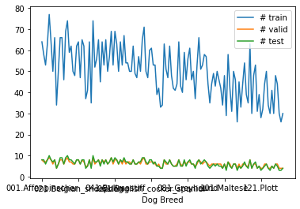
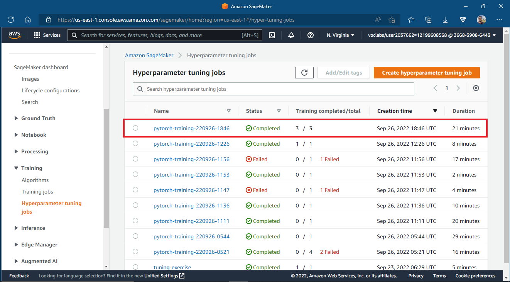
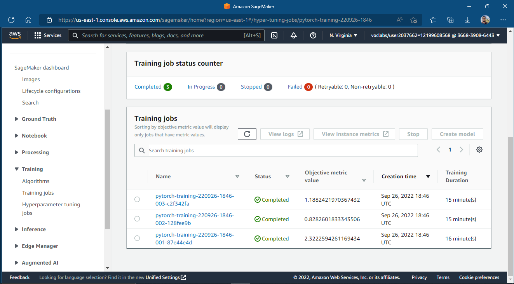
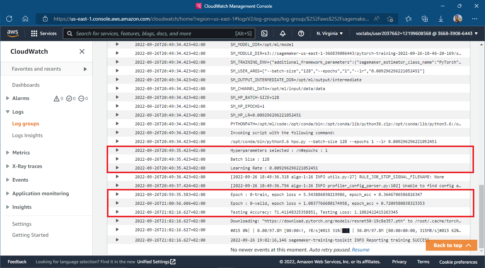
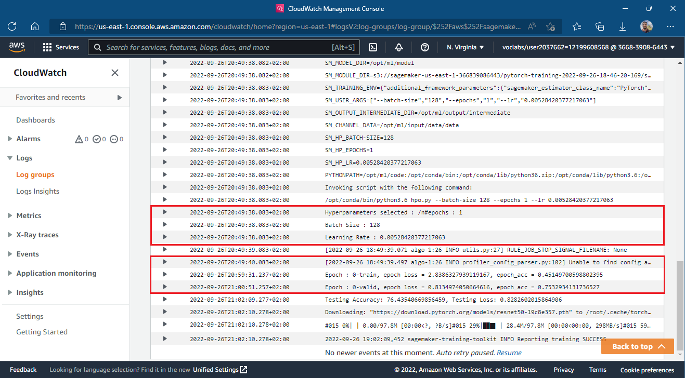
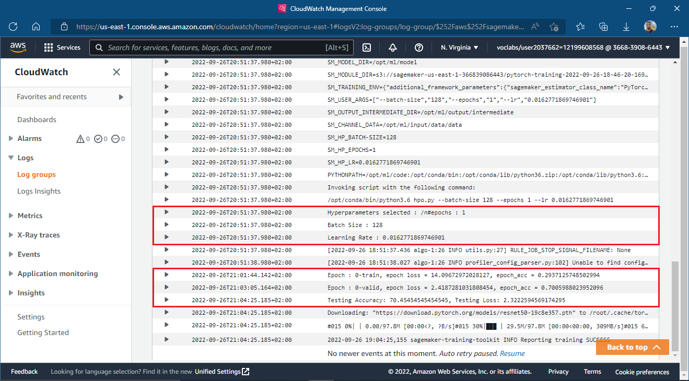
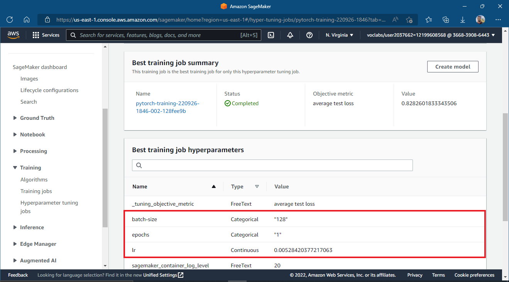
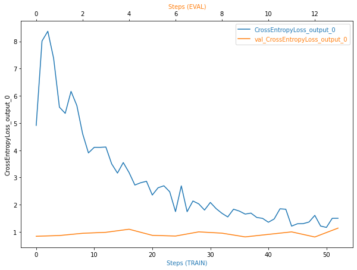
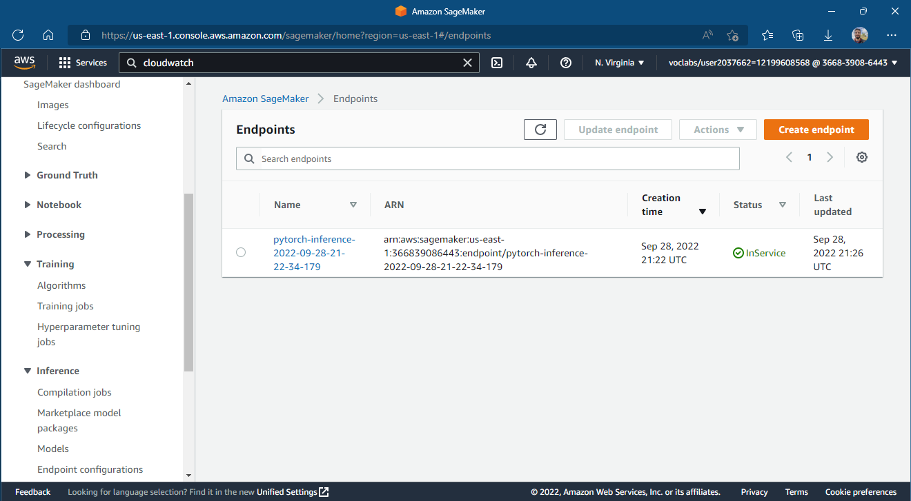

# Image Classification using AWS SageMaker

Use AWS Sagemaker to train a pretrained model that can perform image classification by using the Sagemaker profiling, debugger, hyperparameter tuning and other good ML engineering practices.

The goal of this project is to demonstrate how we can use a pretrained image classification model to classify the dog breed given an image of the dog. This is done by loading the pretrained model then using transfer learning we adapt the model to the dog breed classification dataset.

## Project Set Up and Installation
Enter AWS through the gateway in the course and open SageMaker Studio. 
Download the starter files.
Download/Make the dataset available.

### Steps to Set Up and run the project
- Open the AWS sagemaker console.
- Navigate to Notebook instances & create a Notebook instance (I used ```ml.t3.medium``` instance for hosting the notebook)
- Upload the following files to the instance:
    - ```train_and_deploy.ipynb``` : notebook for interfacing with sagemaker & downloading the dataset.
    - ```scripts/train_model.py``` : script for training the model with debugging & profilling hooks.
    - ```scripts/hpo.py``` : script for training the model without debugging & profilling hooks for hyperparameter tuning.
    - ```scripts/inference.py``` : script for model deployment to an endpoint.
- I used the ```conda_pytorch_p38``` kernel for running the notebook
- Run the notebook cells to download the data, upload it to s3, launch the hyperparameter tuning job, launch the training job, display the debugging & profilling outputs & finally deployment and querying the model.

## Dataset
- The Dataset Contains images of dogs of different breeds.
- There are 133 classes of dog breeds available.
- The Dataset is split into three directories train, validation and testing.
- Each Directory has 133 sub directories, one directory per dog breed class.



***From a quick eda it is clear that:***
- not all classes have the same number of images for train, test & validation.
- Most of the classes have on average 50 train images, 6 validation images, and 6 test images.
- The dataset isn't completely imbalanced with respect to the # of images in each class.

***From a Quick manual exploration it is clear that:***
- Not all images have the same shape.
- Some images are too big.


### Access
Upload the data to an S3 bucket through the AWS Gateway so that SageMaker has access to the data. 

## Hyperparameter Tuning

For this project, I chose to apply transfer learning on the Pretrained ```Resnet50``` model provided by the ```torchvision``` library. ```Resnet50``` is a convolutional neural network with a total of 50 convolutional and fully connected layers. The model has about 25 million trainable parameters. The provided model is trained on the ImageNet dataset so it has learned to find some relations and insights from training on a large number of images, so using transfer learning, we can transfer the knowledge from the pretrained model and use it to enhance the model for the task of dogbreed classification without needing too much data.

### Steps to using the ```Resnet50``` model:
- The Pretrained model is loaded from the ```torchvision``` library.
- The weights of the model are frozen so that they don't get updated during training, thus the model is used as a feature extractor.
- The fully connected layer is replaced by another layer that downsamples the output of the convolutional stages to 133 outputs representing the 133 classes of the ```Dog Breed Dataset```.
- A Softmax layer converts the outputs into probabilities (Actually a log softmax layer is used internally within the crossentropy loss function).
- The fully connected layer is trained using the **Crossentropy** loss function for multiclass classification & using the **ADAM Optimizer**.

### Hyperparameters Chosen
- **learning rate (lr)** : Learning rate usually takes small values on a log scale, the learning rate affects the speed of training and a suitable learning rate doesn't cause the learning process to diverge.
- **batch size** : The batch size affects the speed of training as well as the accuracy. As the batch size increases the outcome values become more stable. However, the training process might get longer.
- **epochs** : The more the model is trained, the better the results, but too much training might cause overfitting.
### Hyperparameters tuning Space

<table>
    <tr>
        <th>Hyperparameter</th>
        <th>Type</th>
        <th>Range</th>
    </tr>
        <td>Learning Rate</td>
        <td>Continous</td>
        <td>interval: [0.001, 0.1]</td>
    </tr>
        <td>Batch Size</td>
        <td>Categorical</td>
        <td>Values : [32, 64, 128]</td>
    </tr>
        <td>Epochs</td>
        <td>Categorical</td>
        <td>Values: [1, 2]</td>
    </tr>
</table>

**Note**:
The search spaces provided for the batch size and the epochs are meant only for experimenting with the tuning pipeline without incurring much cost.

### Hyperparameter Tuning Job on AWS Cloud Gateway
I ran a hyperparemter tuning job using the sagemaker sdk. In order to limit the incurred cost I ran only 3 training jobs in parallel on ml.c5.2xlarge instances.
<br/>
The metric used for choosing the best hyperparameters is the epoch test loss calculated by dividing the epoch running loss from all batches by the number of examples in the test split.

**The following are screenshots from the jobs ran on AWS Cloud Gateway:**

A screenshot showing the completed hyperparamter tuning job.



A screenshot showing the 3 completed training jobs & their final test losses.




A screenshot showing the logged train, valid and test accuracies & losses from Cloudwatch logs
- first job



- second job (best)



- third job


### Best Hyperparameters
A screenshot from the AWS Console showing the best training job according to the test loss and the best hyperparameters chosen for that job.




## Debugging and Profiling

- **Model debugging** is useful for capturing the values of the tensors as they flow through the model during the training & evaluation phases. In addition to saving & monitoring the tensors, sagemaker provides some prebuilt rules for analizing the tensors and extracting insights that are useful for understanding the process of training & evaluating the model.
- I chose the to monitor the ```Loss Not Decreasing``` Rule during debugging the model which monitors if the loss isn't decreasing at an adequate rate.

- **Model Profiling** is useful for capturing system metrics such as bottlenecks, CPU utilization, GPU utilization and so on. I used the ```ProfilerReport``` rule to generate a profiler report with statistics about the training run.

### Steps to apply Debugging and Profilling in Sagemaker
- Create a hook using the smdebug library. 
- Register the hook is to the model to save the tensors & to the loss function to track its value.
- Define the rules from the set of predifined rules of sagemaker debugger & profiler.
```python
rules = [ 
    Rule.sagemaker(rule_configs.loss_not_decreasing()),
    ProfilerRule.sagemaker(rule_configs.ProfilerReport())
]
```
- Define the debugger configuration including the collections to monitor (tensors are clustered into a number of collections) as well as the intervals between each time the hook saves the tensor values.
```python
collection_configs=[
    CollectionConfig(
        name="weights",
        parameters={
            "train.save_interval": "5",
            "eval.save_interval": "1"
        }
    ),
    CollectionConfig(
        name="gradients",
        parameters={
            "train.save_interval": "5",
            "eval.save_interval": "1"
        }
    ),
    CollectionConfig(
        name="biases",
        parameters={
            "train.save_interval": "5",
            "eval.save_interval": "1"
        }
    ),
    CollectionConfig(
        name="CrossEntopyLoss_output_0", 
        parameters={
            "include_regex": "CrossEntropyLoss_output_0",
            "train.save_interval": "1",
            "eval.save_interval": "1"
        }
    )
]
```

- Define the Profiler config to determine the timer interval by which to capture system metrics as well as the framework monitoring config
```python
profiler_config = ProfilerConfig(
    system_monitor_interval_millis=500, framework_profile_params=FrameworkProfile()
)
```

- we need to modify the training script to set the hook mode to ```train``` inside the training function and to ```eval``` inside the testing function and the validation step.

- Finally we pass the debugger configuration , the profiler configuration, thre rules as well as the training script to the pytorch estimator used to submit the training job.

- we can then retrieve the debug-output, profiler-output & rule-output from the training job directory in s3 to analyze them.
### Results

The following is screenshot of tracking the ```cross_entropy_loss_output``` during training and evaluation steps.



**Insights from the Plot**
- The training loss decreases with the number of steps.
- The training loss is a bit noisy, may be this means that the training might have required a larger batch size.
- The validation loss seems to be almost constant and it is very low compared to the training loss from the beginning which might be a sign of overfitting.

**What to be applied if the plot was erronous**
Inorder to avoid overfitting we might try the following solutions:
- Maybe I need to use a smaller model compared to the ```resnet50``` like the ```resnet18``` for example.
- Maybe I need to apply regularization to avoid overfitting over the dataset.
- Maybe I need more data for my model.

## Model Deployment

### Overview on the deployed Model
- The deployed model is a ```resnet50``` model pretrained on the ImageNet dataset and finetuned using the dog breed classification dataset.
- The model takes an image of size (3, 224, 224) as an input and outputs 133 values representing the 133 possible dog breeds availabe in the dataset.
- The model doesn't apply softmax or log softmax (they are applied only inside the nn.crossentropy loss during training).
- The model's output label can be found by taking the maximum over the 133 output values and finding its correponding index.
- The model was finetuned for 1 epoch using a batch size of 128 and learning rate ~0.05.

### Screenshot of the deployed endpoint in service


The model is deployed on one instance of ```ml.t2.medium```
### Instructions to Query the model

- Provide the path of a local image to the Image.open() function from the PIL library to load the image as a PIL image.
```python
cwd = os.getcwd()
path = os.path.join(cwd, "test/001.Affenpinscher/Affenpinscher_00058.jpg")
pil_img = Image.open(path)
```

- Preprocess the image to prepare the tensor input for the ```resnet50``` network.
First the image is resized to (3x256x256) then a center crop is applied to make the image size (3x224x224), the image is then converted to a tensor with values from 0.0 to 1.0 and finally it is normalized by some common known values fro the mean and the standard deviation.

```python
# transforms
preprocess = T.Compose([
   T.Resize(256),
   T.CenterCrop(224),
   T.ToTensor(),
   T.Normalize(
       mean=[0.485, 0.456, 0.406],
       std=[0.229, 0.224, 0.225]
   )
])

image = preprocess(pil_img).unsqueeze(0)
```

- A request is then sent to the endpoint having the image as its payload
```python
response = predictor.predict(image)
```
### Example
- Input image


- Response
```python
[[  8.75180435  -2.39673591  -4.73243904  -2.58364224  -3.12655997
   -4.69459724  -4.91700315   0.20925087  -1.28252411  -4.69724178
   -6.19639254  -4.61702633  -0.1959562   -5.22766113  -3.70985484
   -9.32637787   2.92932057  -2.87671828  -3.61445904  -4.80398226
   -3.69890761  -1.79214704  -0.03427362   0.52362651  -8.08525944
   -1.78680778  -2.94204307  -8.00784397  -7.86408997  -1.37789559
   -4.95504999  -4.61141729   1.48781848  -2.66207027   2.31265283
    0.08962552  -3.34239817   5.9371953   -6.64492083   1.15104353
   -1.14075339   4.10580587  -6.80430794   0.08709467  -2.77319932
    3.14990973  -6.03189707  -0.14118356   1.70128691  -3.20288825
   -5.14803886  -2.98602223  -3.02217889  -6.83412361  -3.2475698
    2.61658454  -3.3683207    2.47357655  -1.34678447  -1.37212551
   -1.15570867   0.43383688  -1.11844242   4.96402836  -1.63055515
   -4.80711269  -2.69961619  -0.67701799  -1.18653047  -5.40414715
   -6.21986818  -4.2561245    0.26153508  -0.31608373   0.41145071
   -3.94431829  -3.35607791 -10.5872364   -9.96873474  -5.03268433
   -2.10532379   4.98820686  -9.55483055  -1.65680575  -3.78380179
   -7.08229542  -5.01223516  -6.44231224  -5.69851542  -3.70648956
   -2.35652184  -3.58251119   1.44485867  -4.43101549  -5.19097948
   -2.10602784  -4.42232943  -7.38172102   9.38558769   3.84224892
    0.13998455  -5.74204159  -2.13060141  -1.7858336   -1.67286777
   -1.8520869    0.70228446  -6.82978106  -4.99912643  -6.64194918
   -3.5172174   -1.70486581  -4.75633717  -2.71399093  -1.42897201
   -2.05804634   2.1108644   -7.05989408   1.67206383  -7.14816761
   -7.10544109  -2.48531008  -1.50545609  -6.91559172   3.5340507
   -7.34921312  -0.98429281  -6.50257587  -2.30569077  -3.86719155
    6.00153255  -2.73402333   0.19892243]]
length of response : 133
```

